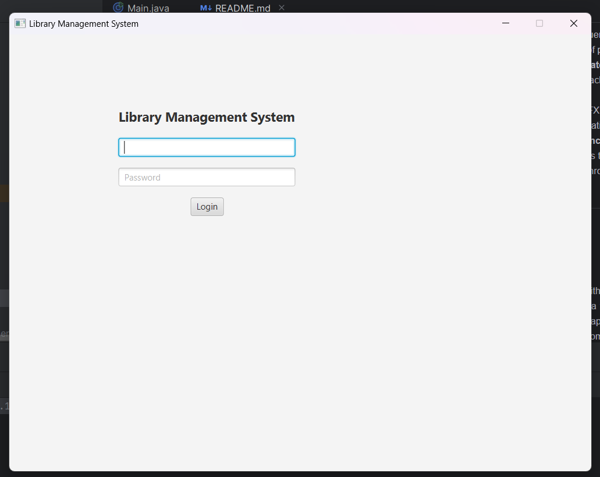
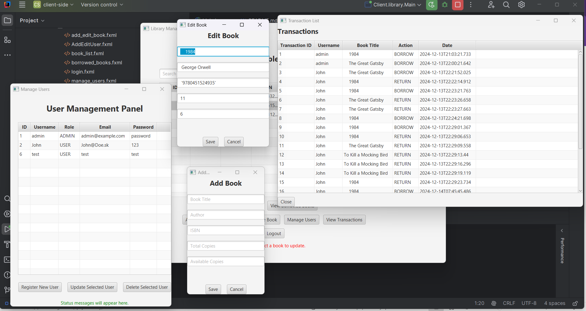
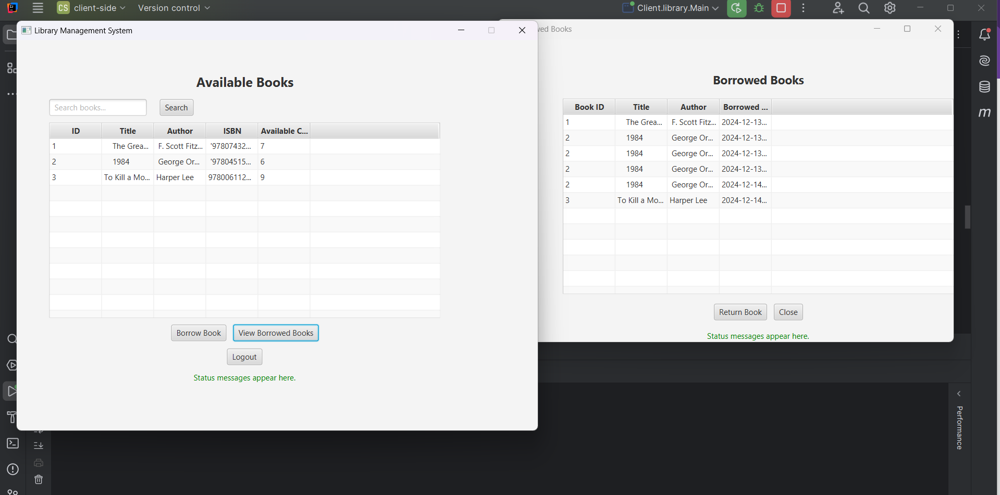
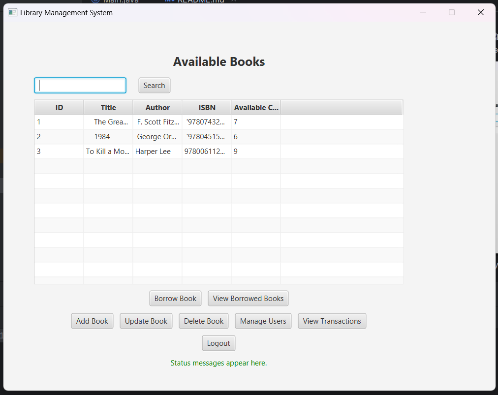
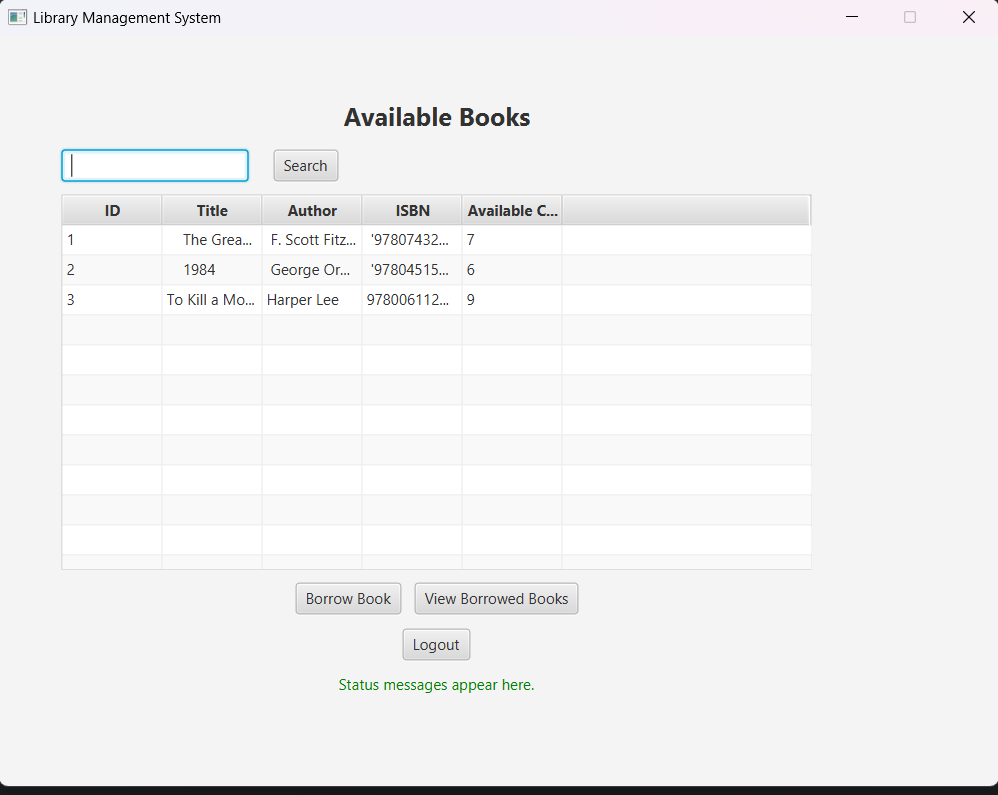

# !!!Due to issues with git/ide, the project needs to be split into two different intelijidea projects, one for client side and one for server side!!! 

# Library Management System

The **Library Management System** is a straightforward and user-friendly application created to handle library operations such as managing books, users, and transactions. It supports role-based access for administrators and regular users, ensuring functionality tailored specifically to each role.

## Features

- **Administrator Role**:
    - Add, update, and delete books.
    - Manage users (create, update, delete, view).
    - View transaction history.

- **User Role**:
    - Search for books.
    - View borrowed books.
    - Borrow and return books.

The application is designed with a focus on usability, security, and modularity.

---

## Technology Stack

The project employs the following technologies:

- **JavaFX**: Used for building an interactive and visually appealing user interface.
- **Spring Boot**: Implements the backend logic, including RESTful APIs.
- **SQLite**: Lightweight relational database for data persistence.
- **RESTful APIs**: Enables seamless client-server communication.

---

## Classes and Functions

### Key Classes and Their Roles:

- **`BookListController`**:
    - Manages the book list (display, search, filter) and book management features.
    - Essential Functions:
        - `handleAddBook()`
        - `handleUpdateBook()`
        - `handleDeleteBook()`
        - `handleBorrowBook()`

- **`AddEditBookController`**:
    - Handles book creation and updates.

- **`LoginController`**:
    - Manages user authentication and session.

- **`ManageUsersController`**:
    - Handles CRUD operations for user management.

- **`BorrowedBooksController`**:
    - Displays and manages borrowed books for regular users.

### Core Functions:

- **`addBook()`**: Adds a new book to the database.
- **`borrowBook()`**: Executes book borrowing process, tracks transactions.
- **`listBooks()`**: Fetches all books from the database.

---

## RESTful API

The backend exposes the following RESTful endpoints:

| HTTP Method | Endpoint                  | Description                       |
|-------------|---------------------------|-----------------------------------|
| **GET**     | `/api/books`              | Retrieves all books.              |
| **POST**    | `/api/books`              | Adds a new book.                  |
| **PUT**     | `/api/books/{id}`         | Updates an existing book.         |
| **DELETE**  | `/api/books/{id}`         | Deletes a book.                   |
| **GET**     | `/api/users`              | Retrieves all users.              |
| **POST**    | `/api/users`              | Adds a new user.                  |
| **PUT**     | `/api/users/{id}`         | Updates an existing user.         |
| **DELETE**  | `/api/users/{id}`         | Deletes a user.                   |

---

## Database Design

The database schema is built with three main tables to support the system's operations.

### Tables:

#### Users Table
| Column       | Type        | Description                   |
|--------------|-------------|-------------------------------|
| `user_id`    | INTEGER     | Primary key.                  |
| `username`   | TEXT        | User's login name.            |
| `password`   | TEXT        | Hashed password.              |
| `role_id`    | INTEGER     | Role (Admin or User).         |

#### Books Table
| Column           | Type        | Description               |
|------------------|-------------|---------------------------|
| `book_id`        | INTEGER     | Primary key.              |
| `title`          | TEXT        | Book's title.             |
| `author`         | TEXT        | Book's author.            |
| `isbn`           | TEXT        | Book's ISBN.              |
| `available_copies` | INTEGER     | Number of available copies.|

#### Transactions Table
| Column           | Type        | Description               |
|------------------|-------------|---------------------------|
| `transaction_id` | INTEGER     | Primary key.              |
| `user_id`        | INTEGER     | ID of the borrowing user. |
| `book_id`        | INTEGER     | ID of the borrowed book.  |
| `action`         | TEXT        | Action type (BORROW/RETURN). |
| `date`           | TEXT        | Date of transaction.      |

---

## User Interface

### Screens Overview:

#### Login Screen
Users authenticate themselves using the login screen.

#### Book Management (Admin)
Admins can add, update, and delete books, as well as manage users and view transactions.

#### Borrow and Return (User)
Regular users can search for books, borrow them, and view their borrowed books.

---

## Challenges and Approach

### Challenges:

1. **Secure Communication**:
    - Preventing unauthorized access between client and server.
    - Approach: Role-based access control (RBAC) was implemented to restrict actions based on user roles.

2. **SQL Injection Protection**:
    - Ensuring SQL queries cannot be exploited for malicious purposes.
    - Approach: Use of prepared statements in database queries.

3. **Thread-Safe UI Updates**:
    - Synchronizing background database calls with JavaFX UI updates.
    - Approach: JavaFX's `Platform.runLater()` was used to ensure thread-safe operations.

4. **Database Concurrency**:
    - Managing access to SQLite by concurrent threads.
    - Approach: Synchronized database access and connection pooling.

---

## How to Run

1. Clone this repository.
2. Open the project in either IntelliJ IDEA or your preferred IDE.
3. Ensure you have Java 14 or above installed.
4. Run the Spring Boot application and JavaFX front-end.
5. Access the system from the login screen, using provided roles (admin/user).

### Screenshots

  [Admin View]
  [User View]
